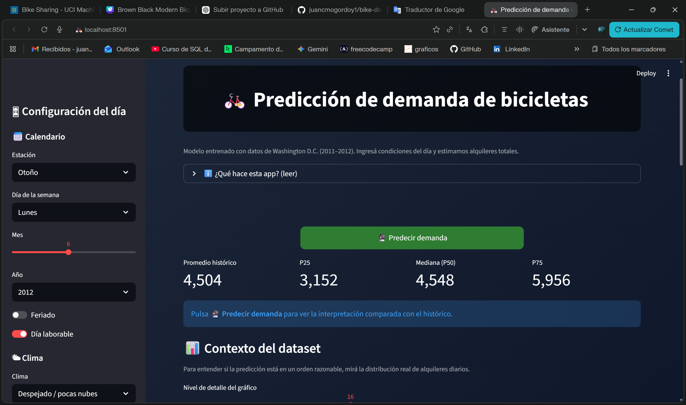

🚲 Predicción de Demanda de Bicicletas
Bike Sharing – Washington D.C. (2011–2012)
https://bike-demand-ml-9kntz6fakehzenxhdznqgb.streamlit.app/
📷 Vista de la aplicación

Proyecto de Machine Learning para predecir la demanda diaria de bicicletas compartidas (cnt) utilizando variables de calendario y condiciones climáticas.

Incluye:
Comparación de múltiples modelos de regresión
Pipeline con preprocesamiento integrado
Prevención de data leakage
Evaluación con train/test split y validación cruzada
Optimización de hiperparámetros
Modelo exportado listo para producción
Aplicación interactiva desarrollada con Streamlit
Interpretabilidad mediante importancia de variables y percentiles históricos

📌 Objetivo del Proyecto

Predecir el total de alquileres diarios (cnt) para un día dado en función de:

Variables de calendario:
season
yr
mnth
weekday
holiday
workingday

Condiciones climáticas:
weathersit
temp
atemp
hum
windspeed

Aplicación práctica:
Planificación operativa, redistribución de bicicletas y estimación de demanda esperada según condiciones previstas.
El problema se define como regresión supervisada.

🧾 Dataset

Bike Sharing Dataset – Washington D.C. (2011–2012)
Fuente: https://archive.ics.uci.edu/dataset/275/bike+sharing+dataset

Archivo utilizado:
data/raw/day.csv (agregado diario)

Se eligió la versión diaria porque:
Reduce ruido respecto al nivel horario
Permite un modelo más interpretable
Facilita una defensa clara del enfoque

🧹 Selección de Variables y Prevención de Data Leakage
Variable objetivo:

y = cnt (total de alquileres por día)

Variables utilizadas (features):

Calendario:
season
yr
mnth
weekday
holiday
workingday

Clima:
weathersit
temp
atemp
hum
windspeed

Columnas descartadas:
instant → identificador sin valor predictivo
dteday → fecha literal
casual y registered → forman parte de cnt (su uso generaría fuga de información)
Esta decisión garantiza que el modelo solo utilice información disponible antes de que ocurra el día a predecir.

⚙️ Preparación de Datos

Se implementó un ColumnTransformer para:
Aplicar OneHotEncoder a variables categóricas
Mantener variables numéricas como passthrough
Todo el preprocesamiento forma parte del mismo Pipeline que el modelo, asegurando consistencia entre entrenamiento e inferencia en producción.

🧠 Modelado y Comparación de Modelos

Se evaluaron distintos enfoques para contrastar supuestos lineales y no lineales:

Modelo	Tipo	MAE	R²
GradientBoostingRegressor	Ensemble (boosting)	442.90	0.897
RandomForestRegressor	Ensemble (bagging)	442.99	0.883
Ridge	Lineal regularizado	579.70	0.842
KNN (k=25)	Basado en distancia	713.31	0.804

Split utilizado: 80% entrenamiento / 20% test.

El modelo base seleccionado fue:
GradientBoostingRegressor (configuración default)
Motivo: mejor desempeño en MAE y R², capturando relaciones no lineales entre clima y demanda.

🔧 Optimización de Hiperparámetros

Posteriormente se realizó un proceso de optimización utilizando:
Validación cruzada 5-Fold
Métrica principal: MAE

1️⃣ RandomizedSearchCV – RandomForestRegressor

Se utilizó RandomizedSearch debido a la gran cantidad de hiperparámetros relevantes en RandomForest.
25 combinaciones evaluadas
Exploración aleatoria dentro de rangos definidos
CV 5-Fold

Mejor resultado (CV):
MAE ≈ 509.59

2️⃣ GridSearchCV – GradientBoostingRegressor

Se utilizó GridSearch con un grid controlado sobre:
n_estimators
learning_rate
max_depth
subsample
min_samples_split
min_samples_leaf

Total evaluado:
486 combinaciones × 5 folds = 2430 entrenamientos

Mejor resultado (CV):
MAE ≈ 465.04

Mejores hiperparámetros:
learning_rate = 0.03
max_depth = 4
min_samples_split = 10
min_samples_leaf = 1
n_estimators = 350
subsample = 0.8

🏆 Modelo Final Seleccionado

El modelo final fue:
GradientBoostingRegressor optimizado con GridSearchCV

Evaluación en conjunto de test:
MAE: 414.21
R²: 0.907
Esto representa una mejora respecto al modelo baseline, confirmando el impacto positivo del proceso de tuning.
El modelo fue reentrenado con el 100% del dataset y exportado como:
models/gradient_boosting.pkl

📊 Interpretabilidad

Se implementaron dos mecanismos de interpretación:
1️⃣ Importancia de Variables

Exportada en:
reports/feature_importance.csv
Permite identificar qué factores influyen más en la demanda.

2️⃣ Contexto Histórico con Percentiles
Se calcularon:
Media histórica
Percentiles P25, P50, P75

Clasificación de la predicción:
Baja demanda → menor a P25
Demanda normal → entre P25 y P75
Alta demanda → mayor a P75
Esto transforma una predicción numérica en una interpretación operativa.

🖥️ Aplicación Web (Streamlit)

La aplicación permite:
Ingresar condiciones del día (clima + calendario)
Obtener predicción de demanda (cnt)
Mostrar rango orientativo ±12%
Comparar contra percentiles históricos

Arquitectura:
La app no entrena el modelo
Solo carga el pipeline exportado (gradient_boosting.pkl)
Garantiza consistencia con el entrenamiento

▶️ Ejecución Local
python -m venv .venv
source .venv/bin/activate   # Windows: .venv\Scripts\activate
pip install -r requirements.txt

# Entrenamiento con tuning
python .\src\tune_search.py

# Ejecutar app
streamlit run .\app.py

📁 Estructura del Proyecto
bike-demand-ml/
├── data/raw/day.csv
├── models/
│   ├── gradient_boosting.pkl
│   ├── gradient_boosting_hour_circular.pkl
│   └── model.pkl
├── reports/
│   ├── model_comparison.csv
│   └── feature_importance.csv
├── notebooks/
│   ├── 01_eda_modeling.ipynb
│   └── 02_hour_modeling.ipynb
├── src/
│   ├── train_compare.py
│   ├── train.py
│   └── tune_search.py
├── app.py
├── requirements.txt
└── README.md
🎯 Resultado Final

Con datos históricos de bicicletas y variables climáticas:

Se entrenó un modelo de ML sin fuga de información
Se evaluó correctamente con train/test split y validación cruzada
Se optimizaron hiperparámetros con GridSearch y RandomizedSearch
Se seleccionó el mejor modelo según métricas objetivas
Se exportó para producción
Se implementó una app interactiva
Se agregó contexto histórico para interpretación

Autor: Juan Cruz Mogordoy